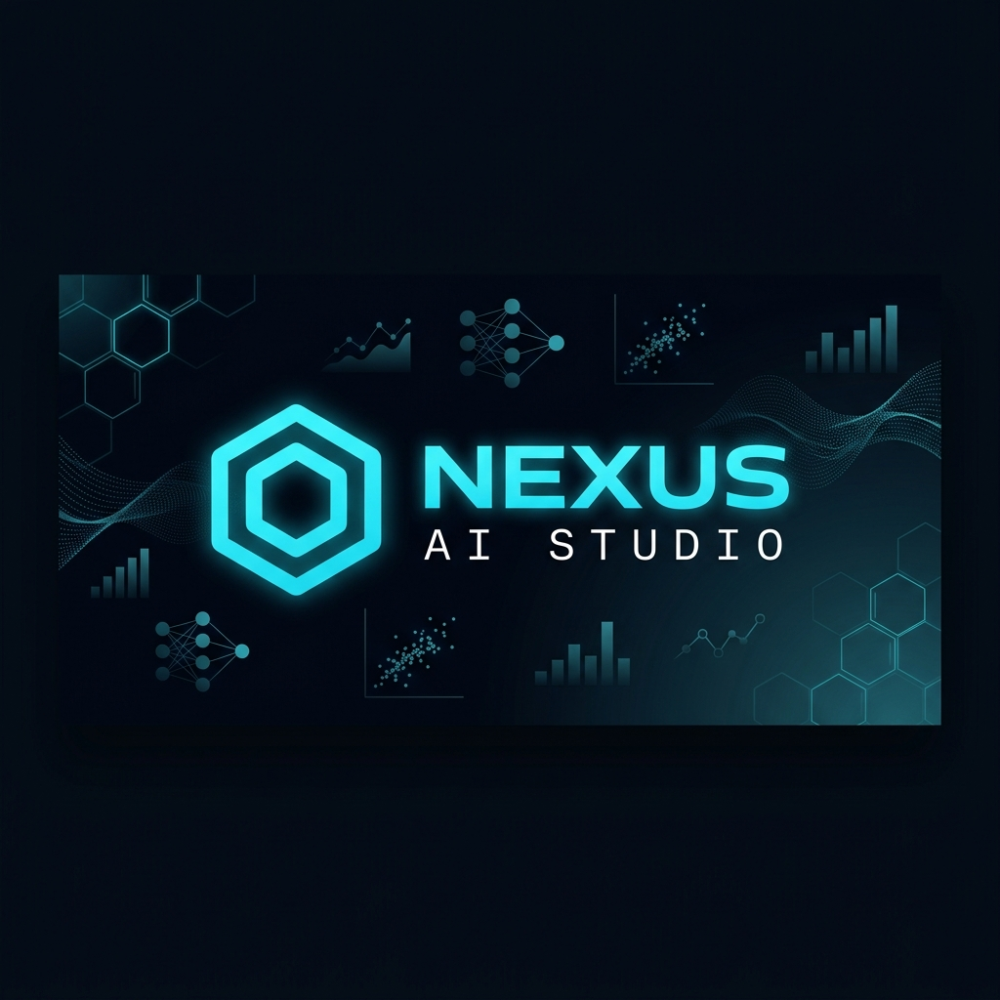
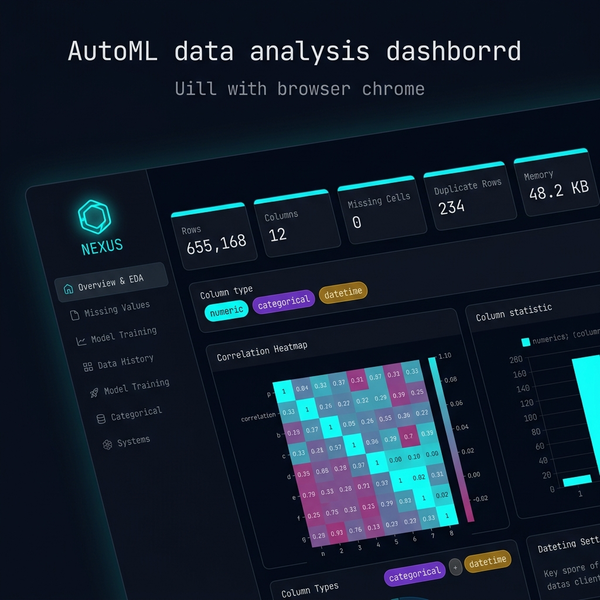
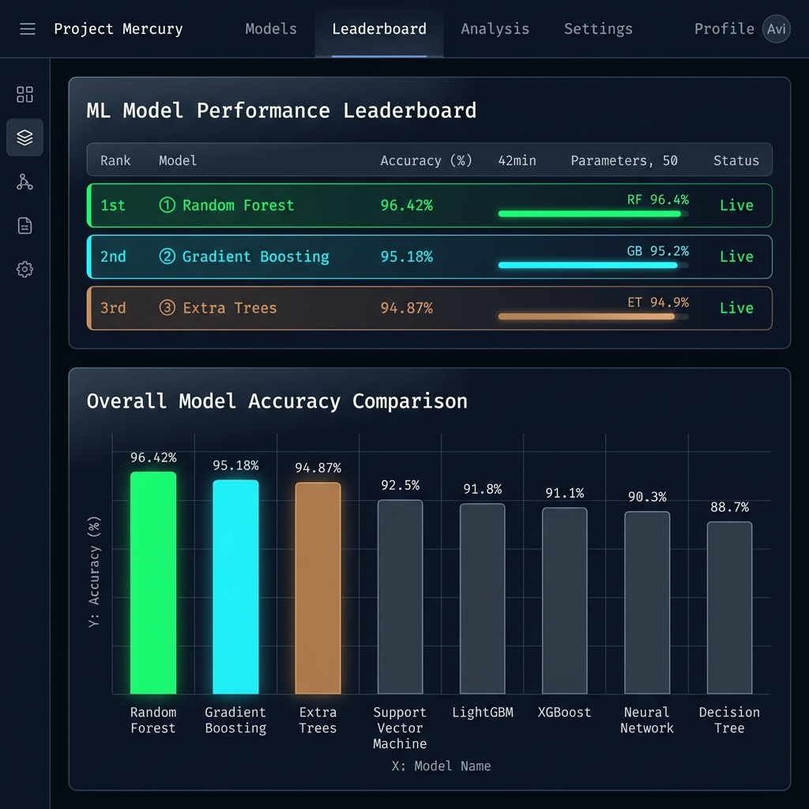

<p align="center">
  
</p>

<p align="center">
  <strong>⬡ NEXUS — AI Studio</strong><br/>
  <em>Automated Machine Learning & Exploratory Data Analysis Platform</em>
</p>

<p align="center">
  <a href="https://nexus-ai-studio.streamlit.app"></a>
</p>

<p align="center">
  <a href="https://www.python.org/downloads/"></a>
  <a href="https://streamlit.io"></a>
  <a href="https://scikit-learn.org"></a>
  <a href="LICENSE"></a>
  <a href="https://nexus-ai-studio.streamlit.app"></a>
</p>

<p align="center">
  <a href="#-live-demo">Live Demo</a> •
  <a href="#-features">Features</a> •
  <a href="#-screenshots">Screenshots</a> •
  <a href="#-quick-start">Quick Start</a> •
  <a href="#-architecture">Architecture</a> •
  <a href="#-tech-stack">Tech Stack</a> •
  <a href="#-contributing">Contributing</a> •
  <a href="#-license">License</a>
</p>

---

## 🚀 Overview

**Nexus AI Studio** is a premium, zero-code Automated Machine Learning (AutoML) platform built with Streamlit. Upload any CSV dataset and Nexus will guide you through the entire data science pipeline — from exploratory analysis to model deployment — all within an elegant dark-themed interface.

No coding required. No ML expertise needed. Just upload, analyze, train, and predict.

<br/>

## 🌐 Live Demo

> **Try Nexus AI Studio instantly — no installation required!**
>
> 🔗 **[https://nexus-ai-studio.streamlit.app](https://nexus-ai-studio.streamlit.app)**

The app is publicly deployed on **Streamlit Community Cloud** and auto-updates with every push to `main`.

<br/>

## ✨ Features

<table>
<tr>
<td width="50%">

### 📊 Exploratory Data Analysis
- **Auto-detect** column types (numeric, categorical, datetime, boolean, high-cardinality)
- **Statistical summaries** with full dtype reports
- **Interactive distributions** — histograms, box plots, violin plots
- **Correlation matrix** with top-correlated feature pairs
- **Pairplot generation** for visual feature relationships
- **Smart CSV parsing** — auto-detects encoding & separator

</td>
<td width="50%">

### 🧹 Data Preprocessing
- **Missing value analysis** with visual heatmaps
- **7 imputation strategies** — median, mean, mode, KNN, ffill, bfill, constant
- **Outlier detection** via IQR, Z-Score, or combined methods
- **Outlier treatment** — winsorize, remove, or replace with median
- **Auto-imputation** fallback for model training

</td>
</tr>
<tr>
<td width="50%">

### 🔧 Feature Engineering
- **Interaction features** — add, subtract, multiply, divide, squared sum
- **Polynomial features** — degree 2 to 4
- **Binning / Discretization** — equal width, equal frequency, custom edges
- **PCA dimensionality reduction** with explained variance visualization

</td>
<td width="50%">

### 🤖 Model Training & Comparison
- **9 classification algorithms** — Random Forest, Gradient Boosting, SVM, KNN, Naive Bayes, etc.
- **11 regression algorithms** — Ridge, Lasso, ElasticNet, SVR, etc.
- **Cross-validation** with auto-adjusted folds
- **Full model comparison** leaderboard with ranked results
- **Feature importance** visualization (tree-based & coefficients)

</td>
</tr>
<tr>
<td width="50%">

### 🎯 Live Prediction
- **Interactive prediction interface** with auto-populated form fields
- **Class probability visualization** for classification tasks
- **Feature scaling** applied consistently with training pipeline
- **Unknown category handling** with graceful fallbacks

</td>
<td width="50%">

### 📋 Export & Reporting
- **Download** raw data, cleaned data, model comparison CSVs
- **Full EDA report** generation in Markdown format
- **Model performance report** with training metadata
- **Statistics export** for further analysis

</td>
</tr>
</table>

<br/>

## 📸 Screenshots

<p align="center">
  
  <br/><em>Exploratory Data Analysis — Dataset overview with column type mapping and statistical summaries</em>
</p>

<br/>

<p align="center">
  
  <br/><em>Model Comparison Leaderboard — All algorithms ranked by performance</em>
</p>

<br/>

## ⚡ Quick Start

### Prerequisites
- Python **3.10** or higher
- pip (Python package manager)

### Installation

```bash
# Clone the repository
git clone https://github.com/nakshaatraa/nexus-ai-studio.git
cd nexus-ai-studio

# Create a virtual environment (recommended)
python -m venv venv

# Activate the virtual environment
# On Windows:
venv\Scripts\activate
# On macOS/Linux:
source venv/bin/activate

# Install dependencies
pip install -r requirements.txt
```

### Run the Application

```bash
streamlit run app.py
```

The app will launch at `http://localhost:8501` — upload any CSV file to get started!

> 💡 **Don't want to install locally?** Use the [live demo](https://nexus-ai-studio.streamlit.app) instead!

### Quick Demo

```bash
# Use the included sample dataset
streamlit run app.py
# → Upload 'expenses.csv' from the project root
```

<br/>

## 🏗️ Architecture

```
nexus-ai-studio/
│
├── app.py                    # 🚀 Main application (1500+ lines of premium UI + ML logic)
├── requirements.txt          # 📦 Python dependencies
├── expenses.csv              # 📊 Sample dataset for quick demo
│
├── .streamlit/
│   └── secrets.toml          # 🔐 API keys (not committed)
│
├── docs/
│   └── images/
│       ├── banner.png        # 🎨 Repository banner
│       ├── screenshot_eda.png
│       └── screenshot_comparison.png
│
├── .github/
│   ├── workflows/
│   │   └── ci.yml            # ⚙️ CI pipeline
│   ├── ISSUE_TEMPLATE/
│   │   ├── bug_report.md
│   │   └── feature_request.md
│   ├── pull_request_template.md
│   └── FUNDING.yml
│
├── CONTRIBUTING.md            # 🤝 Contribution guidelines
├── CODE_OF_CONDUCT.md         # 📜 Community standards
├── SECURITY.md                # 🔒 Security policy
├── CHANGELOG.md               # 📝 Version history
└── LICENSE                    # ⚖️ MIT License
```

### Pipeline Flow

```mermaid
graph LR
    A["📁 Upload CSV"] --> B["📊 EDA & Overview"]
    B --> C["🧹 Missing Values"]
    C --> D["📈 Outlier Detection"]
    D --> E["🔧 Feature Engineering"]
    E --> F["🤖 Model Training"]
    F --> G["🏆 Model Comparison"]
    G --> H["🎯 Live Prediction"]
    H --> I["📋 Export & Report"]

    style A fill:#00c8f0,stroke:#07090d,color:#07090d
    style B fill:#0d1117,stroke:#00c8f0,color:#ddeeff
    style C fill:#0d1117,stroke:#00c8f0,color:#ddeeff
    style D fill:#0d1117,stroke:#00c8f0,color:#ddeeff
    style E fill:#0d1117,stroke:#00c8f0,color:#ddeeff
    style F fill:#0d1117,stroke:#00c8f0,color:#ddeeff
    style G fill:#0d1117,stroke:#00c8f0,color:#ddeeff
    style H fill:#0d1117,stroke:#00c8f0,color:#ddeeff
    style I fill:#00f5a0,stroke:#07090d,color:#07090d
```



<br/>

## 🛠️ Tech Stack

| Category | Technology |
|----------|-----------|
| **Frontend** | [Streamlit](https://streamlit.io) with custom CSS (dark glassmorphism theme) |
| **ML Engine** | [scikit-learn](https://scikit-learn.org) (20+ algorithms) |
| **Data Processing** | [Pandas](https://pandas.pydata.org), [NumPy](https://numpy.org) |
| **Visualization** | [Matplotlib](https://matplotlib.org), [Seaborn](https://seaborn.pydata.org) |
| **Typography** | [Syne](https://fonts.google.com/specimen/Syne), [Space Mono](https://fonts.google.com/specimen/Space+Mono), [DM Mono](https://fonts.google.com/specimen/DM+Mono) |
| **Language** | Python 3.10+ |

### Supported Algorithms

<details>
<summary><strong>🔵 Classification (9 algorithms)</strong></summary>

| Algorithm | Implementation |
|-----------|---------------|
| Random Forest | `RandomForestClassifier` |
| Extra Trees | `ExtraTreesClassifier` |
| Gradient Boosting | `GradientBoostingClassifier` |
| AdaBoost | `AdaBoostClassifier` |
| Decision Tree | `DecisionTreeClassifier` |
| Logistic Regression | `LogisticRegression` |
| K-Nearest Neighbors | `KNeighborsClassifier` |
| Naive Bayes | `GaussianNB` |
| Support Vector Machine | `SVC` |

</details>

<details>
<summary><strong>🟢 Regression (11 algorithms)</strong></summary>

| Algorithm | Implementation |
|-----------|---------------|
| Random Forest | `RandomForestRegressor` |
| Extra Trees | `ExtraTreesRegressor` |
| Gradient Boosting | `GradientBoostingRegressor` |
| AdaBoost | `AdaBoostRegressor` |
| Decision Tree | `DecisionTreeRegressor` |
| Ridge Regression | `Ridge` |
| Lasso Regression | `Lasso` |
| ElasticNet | `ElasticNet` |
| Linear Regression | `LinearRegression` |
| K-Nearest Neighbors | `KNeighborsRegressor` |
| Support Vector Regression | `SVR` |

</details>

<br/>

## 🎨 Design Philosophy

Nexus AI Studio is built with a **brutalist-minimal dark design system** inspired by terminal aesthetics and modern data platforms:

- **Color Palette**: Deep navy base (`#07090d`) with cyan (`#00c8f0`), green (`#00f5a0`), amber (`#f0b429`), and red (`#f05779`) accent system
- **Typography**: Triple-font system — Syne (display), Space Mono (labels), DM Mono (body)
- **Components**: Custom-styled metrics, score boxes, feature importance bars, probability tracks, and comparison leaderboards
- **Interactions**: Hover glow effects, smooth transitions, and responsive layouts

<br/>

## 🤝 Contributing

Contributions are welcome! Please see our [Contributing Guide](CONTRIBUTING.md) for details on:

- Setting up the development environment
- Code style guidelines
- Submitting pull requests
- Reporting bugs

<br/>

## 📜 License

This project is licensed under the **MIT License** — see the [LICENSE](LICENSE) file for details.

<br/>

## 🙏 Acknowledgments

- [Streamlit](https://streamlit.io) — for the incredible app framework
- [scikit-learn](https://scikit-learn.org) — for the robust ML library
- [Seaborn](https://seaborn.pydata.org) & [Matplotlib](https://matplotlib.org) — for beautiful visualizations

<br/>

---

<p align="center">
  <strong>⬡ Built with precision by <a href="https://github.com/nakshaatraa">@nakshaatraa</a></strong><br/>
  <sub>If you found this useful, consider giving it a ⭐</sub>
</p>
